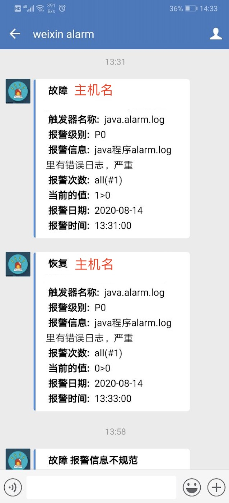

<h1 align="center">open-falcon 企业微信报警插件</h1>

<div align="center">

[](https://www.python.org/downloads/release/python-2716/)
[](https://flask.palletsprojects.com/en/1.1.x/)

</div>

```
 ███████╗██╗      █████╗ ███████╗██╗  ██╗    ███████╗ █████╗ ██╗      ██████╗ ██████╗ ███╗   ██╗    ██╗    ██╗███████╗ ██████╗██╗  ██╗ █████╗ ████████╗
 ██╔════╝██║     ██╔══██╗██╔════╝██║ ██╔╝    ██╔════╝██╔══██╗██║     ██╔════╝██╔═══██╗████╗  ██║    ██║    ██║██╔════╝██╔════╝██║  ██║██╔══██╗╚══██╔══╝
 █████╗  ██║     ███████║███████╗█████╔╝     █████╗  ███████║██║     ██║     ██║   ██║██╔██╗ ██║    ██║ █╗ ██║█████╗  ██║     ███████║███████║   ██║
 ██╔══╝  ██║     ██╔══██║╚════██║██╔═██╗     ██╔══╝  ██╔══██║██║     ██║     ██║   ██║██║╚██╗██║    ██║███╗██║██╔══╝  ██║     ██╔══██║██╔══██║   ██║
 ██║     ███████╗██║  ██║███████║██║  ██╗    ██║     ██║  ██║███████╗╚██████╗╚██████╔╝██║ ╚████║    ╚███╔███╔╝███████╗╚██████╗██║  ██║██║  ██║   ██║
 ╚═╝     ╚══════╝╚═╝  ╚═╝╚══════╝╚═╝  ╚═╝    ╚═╝     ╚═╝  ╚═╝╚══════╝ ╚═════╝ ╚═════╝ ╚═╝  ╚═══╝     ╚══╝╚══╝ ╚══════╝ ╚═════╝╚═╝  ╚═╝╚═╝  ╚═╝   ╚═╝   1.0 Plus
```

# 获取代码
```
cd /opt/

git clone https://github.com/W-BC0001/flask-falcon-wechat.git

cd flask-falcon-wechat/flask-falcon-wechat
```

# 部署方式

#### [虚拟机部署方式](./static/documents/deploy.md)  

#### [docker-compose 部署方式](./static/documents/docker-deploy.md)

# open-falcon 接入 flask-falcon-wechat 报警方式  

> 接口地址一定要加上最后的/  
> [接口调用方法](./static/documents/api.md)  

```
vim alarm/config/cfg.json
...
    "api": {
        "im": "http://127.0.0.1:2333/v1/send/",
...
```

重启open-falcon alarm插件
```
./open-falcon restart alarm
```

# 使用截图
  

 
